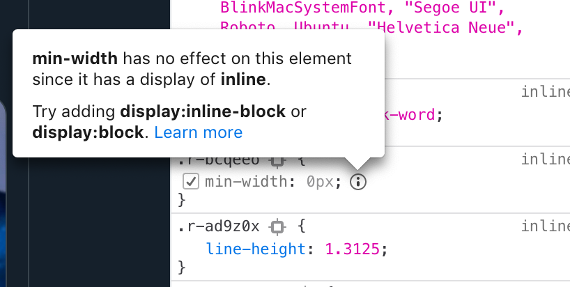
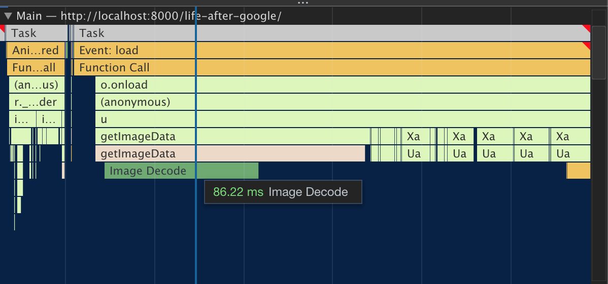
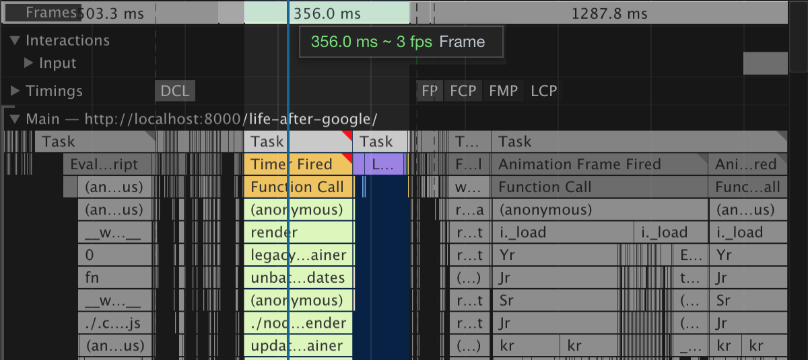
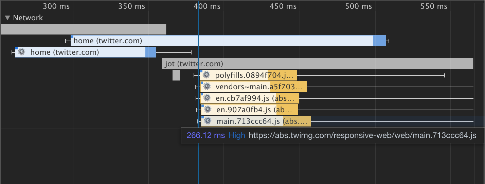
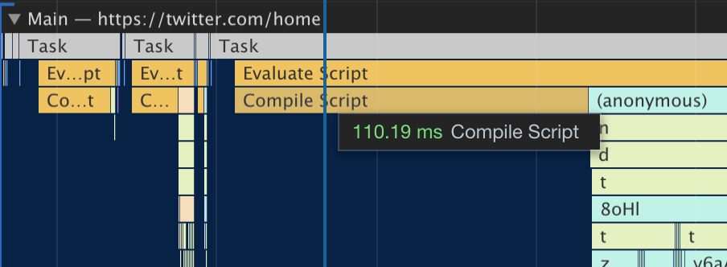
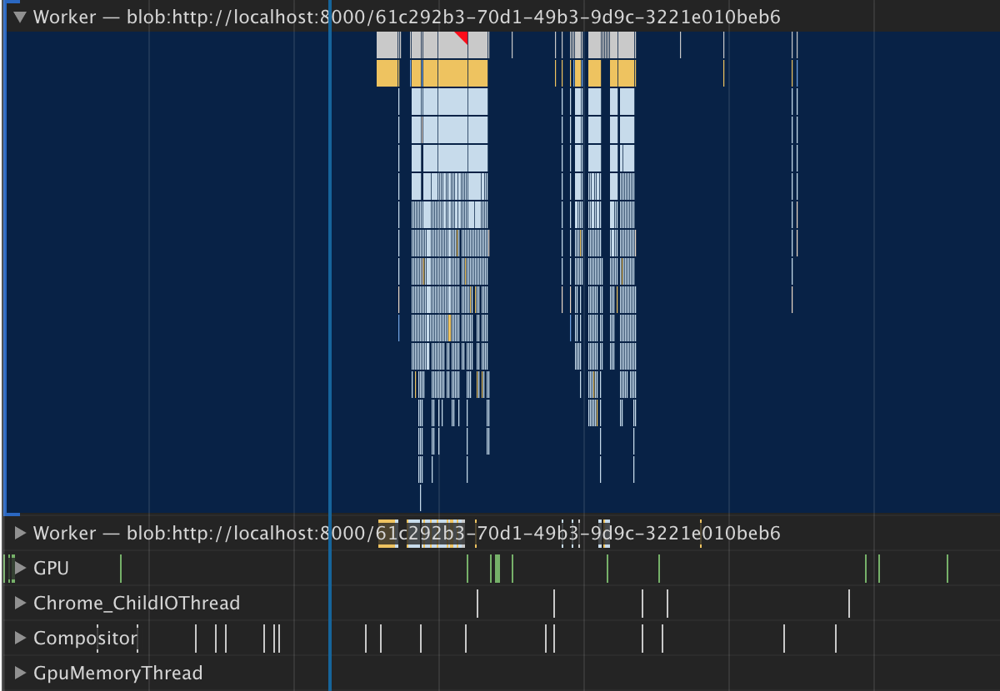
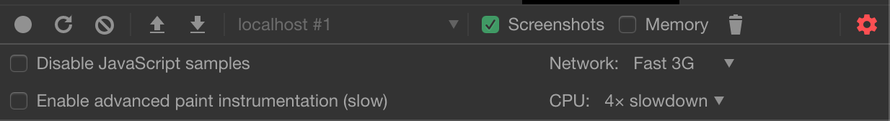

We all heard many times that the Chrome market share is dangerously high. And I agree! One company shouldn't have this much control
over the web. But I'm not planning on switching any time soon.

Don't get me wrong, I like the new 'quantum' Firefox. The new release is great! _Aw man, it was over two years ago?_
It has everything that you want: fast, modern and cool. Along with the overhauled core engine came new features to
the developer tools like CSS grid inspector, fonts tab, or a tooltip explaining why certain CSS rule is not applied.

  An awesome feature that shows how incompetent you're with CSS

But the biggest reason why I still use Chrome for web development is its' superior DevTools — a powerful set of tools
that help you build and debug web applications. And in this post, I want to highlight my favorite feature – the "Performance" tab.

## "Performance" tab

The "Performance" tab is a profiler for your web application. What does a profiler do? It answers the question "What the hell is happening?"
It allows you to understand what exactly is happening in an application during the recorded period.

This powerful profiler is always available and you don't have to cash out for a [license](https://www.ej-technologies.com/buy/jprofiler/select)

You can see every function execution, who called it, and how long did it run.

Skipping frames or having troubles with keeping smooth 60 fps? Check out how much stuff is happening inside a single frame.
Is it 16 milliseconds or less? DevTools will highlight long-running tasks with a red triangle, that's a great place to start if you're having
performance problems.

  A single frame took 356 milliseconds. oof

Page jumps during loading but it's hard to figure out what is happening? With DevTools you can inspect how your application loads _frame by frame_.

<video autoPlay loop muted style={{ width: "100%", height: "auto" }}>
  <source src="/screenshot-devtools.mp4" type="video/mp4" />
  Your browser does not support the video tag.
</video>

  Debugging a performance of a blog post about performance. Meta

Are you sure network requests are in the right order? With profiler, you can understand network requests better so that you can optimize them by reordering.

  JS bunldes requests when loading twitter.com. Nice and parallel (or is it
  concurrent?)

Not only you have access to timings of your code but also you can look at the tasks that the browser is doing, for example compiling JavaScript code.

  Compilation time of one of the JS files from twitter.com

Profiler also shows timings from other places like WebWorkers, GPU or Compositor.

  Ah yes Chrome_ChildIOThread. Wait, what?

Do you want to test how your app will behave on real devices and not on your 6 core brand new fruity laptop?
There's a feature for that! Set CPU and Network throttling in the settings of the profiler.

  Although this is useful you should always test on real devices

Chrome DevTools is just miles ahead. That's why I'm sticking with Chrome for now.
