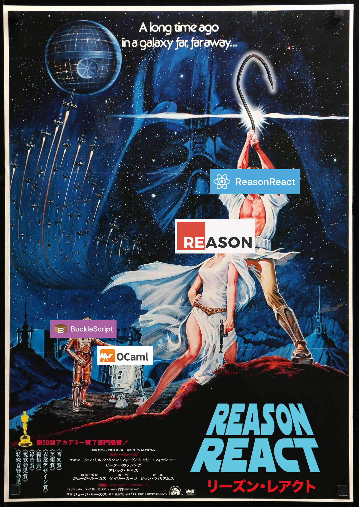

With the latest update to Reason Reaсt, there has never been a better time to try it out.
Hooks and functional components map nicely to reason so let's give it a try!

## Before we start

First lets quickly explain some new words that might be unfamiliar:

- BuckleScript - compiles Reason to JavaScript
- OCaml - programming language. Grossly simplified, Reason is OCaml but with slightly different syntax.

## Preparing

First, install a plugin for your editor over [here](https://reasonml.github.io/docs/en/editor-plugins).
If you're using VSCode than you should grab [this one](https://marketplace.visualstudio.com/items?itemName=jaredly.reason-vscode).

## Setting up

Setting up a new ReasonReact project is not that much different from other cli tools like create-react-app.

To set up new ReaonReact project run

```bash
npx bsb -init my-app -theme react-hooks
```

> `npx` is a package runner. It's a part of npm so you already have it.

Where `my-app` is the name of a project and `react-hooks` is a theme (or a template).

## Project structure

Let's look at what `bsb` kindly generated for us. I'll omit unimportant parts like .gitignore.

```
src/
package.json
webpack.config.js
bsconfig.json
```

So `src`, `package.json` and `webpack.config.js` are here as expected of any typical front-end project.
What about `bsconfig.json`? This is a configuration for bucklescript that tells how to compile reason
`.re` file to javascript.

bsconfig.json

```json
{
  "name": "react-hooks-template",
  "reason": {
    "react-jsx": 3
  },
  "sources": {
    "dir": "src",
    "subdirs": true
  },
  "package-specs": [
    {
      "module": "commonjs",
      "in-source": true
    }
  ],
  "suffix": ".bs.js",
  "namespace": true,
  "bs-dependencies": ["reason-react"],
  "refmt": 3
}
```

I won't go over each field but if you're interested in what every parameter does you
can check [bucklescript documentation](https://bucklescript.github.io/docs/en/build-configuration).

One important parameter is `suffix`. It tells how compiled javascript files will be called.
By default (and you **shouldn't** change this) it will replace `.re` with `.bs.js`.
Together with enabled `in-source` parameter bucklescript will place compiled reason files
alongside source files with new suffix `.bs.js`. This allows for great interop with JS if you're
gradually adding reason to your project as it allows to do predictable imports `require('./SomeModule.bs')`.

## Running

Starting this project consists of two parts:

- compiling .re -> .bs.js
- bundling and serving as any other react project

Compiling can be done in watch mode by running `npm run start` or if you are using VSCode
plugin **it will compile reason file on save**. Yes, bucklescript is _that fast_ that you can leave
it up to editor plugin. 🤯

And for serving bunled app you can run `npm run server`.

## Actually running

First, let's install all dependencies with `npm install`.

Then start bucklescript in watch mode (you can skip this if you're using VSCode plugin) and
webpack server in parallel.

```bash
$ npm start
$ npm run server
```

And your ReasonReact app should be running at [http://localhost:8000/](http://localhost:8000/)

`react-hooks` project template contains an example with two components and you should definitely check them out.

## Hooks

There are some examples but let's start from begging and look at how to use hooks in ReasonReact.

First I'll modify `index.html` to leave simple root.

```html
<!DOCTYPE html>
<html lang="en">
  <head>
    <meta charset="UTF-8" />
    <title>ReasonReact Examples</title>
  </head>
  <body>
    <div id="root"></div>

    <script src="Index.js"></script>
  </body>
</html>
```

Then in `Index.re` I'll render only `App` component to element with id `root`

```reason
ReactDOMRe.renderToElementWithId(<App />, "root");
```

And now let's create App component in `App.re`

```reason
[@react.component]
let make = () => <div> {React.string("Hi")} </div>;
```

This looks a lot like a functional component in React.js.

`[@react.component]` is ppx (you can read more about them in my other [blog post](/reason-by-example-2/))
that will convert named parameters of the component to props object. And we also need to use `React.string` helper function as
`string` type is not valid React node in ReasonReact.

### useState

This is not a react blog post without counter example.

```reason
[@react.component]
let make = () => {
  let (count, setCount) = React.useState(_ => 0);

  <div>
    <button onClick={_ => setCount(count => count + 1)}>
      {React.string("click me")}
    </button>
    {React.string("Hi. You clicked " ++ string_of_int(count) ++ " times")}
  </div>;
};
```

You'll notice that for `useState` it is required to pass an initializer function. There is a comment in a ReasonReact source code about this

```reason
/*
 * Yeah, we know this api isn't great. tl;dr: useReducer instead.
 * It's because useState can take functions or non-function values and treats
 * them differently. Lazy initializer + callback which returns state is the
 * only way to safely have any type of state and be able to update it correctly.
 */
```

I don't think this is a big problem. In real life projects most of my `setState` calls have functional updater and for more
complicated situations you should use reducer anyway.

### useEffect

In reason `useEffect` differs slightly from React.js hook because we can't just create an array of mixed types so
effect dependencies are parameters of multiple `useEffect` functions like `useEffect0`, `useEffect1`, etc where the
number at the end means how many dependencies effect has. Dependencies are passed as [tuple](https://reasonml.github.io/docs/en/tuple)
or array for `useEffect1`.

```reason
[@react.component]
let make = () => {
  let (count, setCount) = React.useState(_ => 0);

  React.useEffect1(
    () => {
      Js.log("Hi im side effect with count: " ++ string_of_int(count));
      None;
    },
    [|count|],
  );

  <div>
    <button onClick={_ => setCount(count => count + 1)}>
      {React.string("click me")}
    </button>
    {React.string("Hi. You clicked " ++ string_of_int(count) ++ " times")}
  </div>;
};
```

<video autoPlay loop muted style={{ width: "100%", height: "auto" }}>
  <source src="/useEffect.mp4" type="video/mp4" />
  Your browser does not support the video tag.
</video>

### useReducer

My one of the favorite hooks. With [Variants](#) and [Pattern matching](#) writing reducers is so great!

```reason
type action =
  | Add(int)
  | Reset;

let reducer = (state, action) =>
  switch (action) {
  | Add(amount) => state + amount
  | Reset => 0
  };

[@react.component]
let make = () => {
  let (count, dispatch) = React.useReducer(reducer, 0);

  React.useEffect1(
    () => {
      Js.log("Hi im side effect with count: " ++ string_of_int(count));
      None;
    },
    [|count|],
  );

  <div>
    <button onClick={_ => dispatch(Add(1))}>
      {React.string("click me")}
    </button>
    {React.string("Hi. You clicked " ++ string_of_int(count) ++ " times")}
  </div>;
};
```

Here we declared all available actions as a variant type `action` and how to handle
those actions in `reducer` function.

Notice how concise dispatching is — `dispatch(Add(1))`. In JS we would need to write something like this
`dispatch({ type: "add", amount: 1 })`. And in reason everything is typed so there is no room for typos or the mental load of remembering
action object's shape.

### useMemo

useMemo works as expected with the same way of passing dependencies as in `useEffect`.

```reason
let expensiveValue = React.useMemo1(_ => count * 100, [|count|]);
```

> Please measure performance in your app before wrapping everything in `useMemo`. Most of the time it's not necessary!

### That's it for now

There are more hooks to explore but I think this will be enough to get started and explore ReasonReact.
Also check out my other posts on Reason:

[ReasonML By Example](/reasonml-by-example/)  
[Javascript Interop, Options And Error Handling - ReasonML By Example](/reason-by-example-2/)
