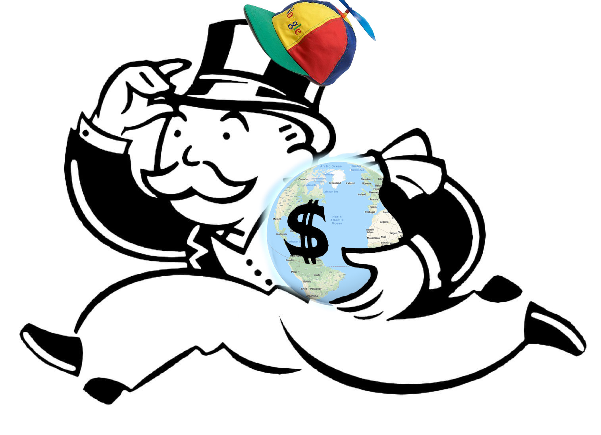
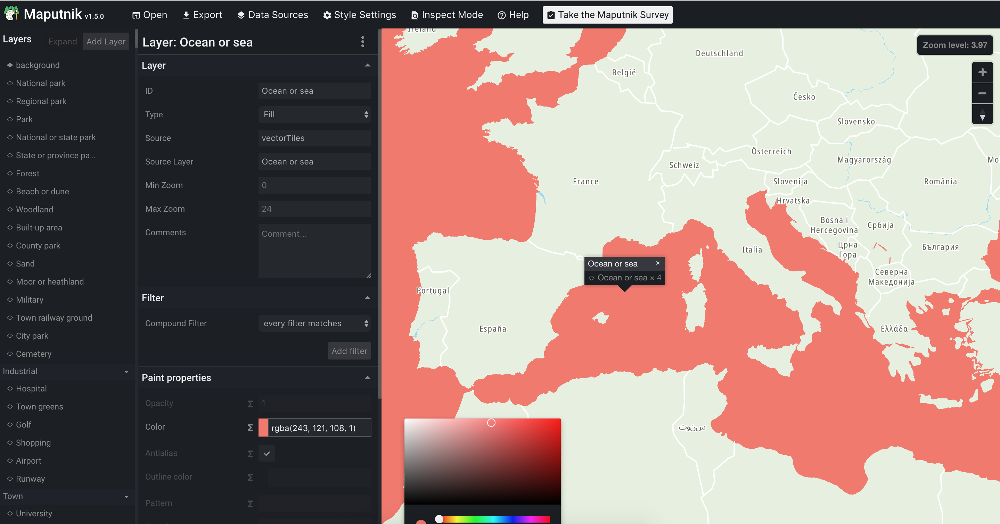

> Disclaimer: Although this is my personal blog I still feel that I should mention that I am a TomTom employee

After Google decided that they want to start making money from their maps APIs and
increased prices a lot of people started to look at alternatives. In this post I'll
show you one of the alternatives that you can use to add interactive,
customizable vector maps for your web app.

## Key pieces

To add a map we need two things: **map data** and **tool for rendering** that data.
For displaying map data there is this great library [Mapbox GL JS](https://docs.mapbox.com/mapbox-gl-js/api/) done by Mapbox.
It is open source and you can use it commercially. (For more info checkout out [license](https://github.com/mapbox/mapbox-gl-js/blob/master/LICENSE.txt)).
It allows us to render raster or vector tiles from any provider that has is compatible with mapbox format.
This means that we are decoupling map data from map rendering which could allow us to change data provider later. <sup><sub>For example in case of sudden price hikes</sub></sup>

## Map Data – Tiles

World map is split into tiles and they contain the map data like roads, oceans, parks etc.
They can be either raster or vector. Raster tiles are just raster images that get directly displayed
while vector tiles contain the data for each map feature then gets rendered. Vector tiles allow for more
flexibility for example: custom styles for everything on the map, smooth scrolling, smaller network footprint,
ability to insert new features between layers.

## Tiles providers

There are some tiles providers on the market:

- Mapbox
- OpenMapTiles (with OpenStreetMap data)
- TomTom
- and probably way more that I'm not aware of

You should explore available options and pick the one that fits your needs best.
For this example I'll use TomTom vector tiles.

## Getting Mapbox GL style definition

This step will differ for every map provider.
All required data definitions you can grab from TomTom Maps API.

Download style json file:

```bash
wget https://api.tomtom.com/map/1/style/20.0.0-8/basic_main.json?key=KEY
```

_Where KEY is your API key from developer portal_

Style file contains layer definitions and urls for tiles, font and icons.

## Setting up map

import Mapbox from "../../../src/components/mapbox.js"

```html
<div id="map-root" style="height: 400px"></div>
<script>
  import mapboxgl from "mapbox-gl"
  import style from "./basic_main.json"

  const map = new mapboxgl.Map({
    container: "map-root", // container id
    style: style, // style that we downloaded in previous step
    center: [125.744496, 39.010425], // starting position
    zoom: 3, // starting zoom
  })
</script>
```

<Mapbox />

Not so hard isn't it? You can explore [examples](https://docs.mapbox.com/mapbox-gl-js/examples/) in mapbox-gl documentation that cover almost any usecase.

## Customizing with Maputnik

One of the coolest things about vector maps is ability to change look and feel of the maps. Vector maps allow granular control over how every layer is displayed.
You can edit layers in style json manually, using scripts (for example desaturating every layer for pretty monochrome look) or using [Maputnik](https://maputnik.github.io/).

Maputnik is an open source editor for mapbox style definitions. It has intuitive interface and allows anyone to easily customize every aspect of your map style.

To edit your style head over to [Maputnik Editor](https://maputnik.github.io/editor/) and upload style json by clicking Open > Upload Style.



On the left it lists all available layers and all the options that you can change for selected layer.
Every change is reflected instantly allowing you to quickly preview changes you made.

Once you are ready you can export new style and use it in mapbox-gl.

## Mapbox + React

There are bindings for react but I find mapboxgl APIs so great to work with I usually write a thin bindings myself.

And because React Hooks is the latest craze and an incredible feature (thanks react team I love you) I'll show you my take on using mapbox with react

Lets start from map component. First of all we can't use name `Map` because that would shadow global [Map](https://developer.mozilla.org/en-US/docs/Web/JavaScript/Reference/Global_Objects/Map) object.

```jsx
import React from "react"
import mapboxgl from "mapbox-gl"
import style from "./basic_main.json"

// Context for mapbox Map object https://docs.mapbox.com/mapbox-gl-js/api/#map
const MapContext = React.createContext(undefined)

// Hook for getting mapbox Map object
export const useMap = () => React.useContext(MapContext)

function Mapbox(props) {
  // Ref for root html element
  const mapRoot = React.useRef(undefined)
  // State for mapbox Map object
  const [map, setMap] = React.useState(undefined)

  // Declare a map initialization effect
  React.useEffect(() => {
    const mapObj = new mapboxgl.Map({
      container: mapRoot.current,
      style: style,
      center: [125.744496, 39.010425],
      zoom: 8,
    })

    // We need to wait for 'load' event
    mapObj.on("load", () => setMap(mapObj))
  }, [])

  return (
    <div ref={mapRoot} style={{ height: "400px", margin: "20px 0" }}>
      {map !== undefined && (
        <MapContext.Provider value={map}>{props.children}</MapContext.Provider>
      )}
    </div>
  )
}

export default Mapbox
```

And now in child components of Mapbox we can use `map` object using `useMap` hook.
For example here is a component that displays circle at a point defined by some GeoJSON.

```jsx
import React from "react"
import { useMap } from "./mapbox"

function GeojsonCircles(props) {
  // Getting map from context
  const map = useMap()

  // Defining data source and layer
  React.useEffect(() => {
    map.addSource("circle-source", {
      type: "geojson",
      // By default we're using just an empty geojson
      data: {
        type: "FeatureCollection",
        features: [],
      },
    })
    map.addLayer({
      id: "circle-layer",
      type: "circle",
      source: "circle-source",
      paint: {
        "circle-color": "red",
      },
    })

    return () => {
      map.removeLayer("circle-layer")
      map.removeSource("circle-source")
    }
  }, [])

  // Updating data
  React.useEffect(() => {
    map.getSource("circle-source").setData(props.geojson)
  }, [props.geojson])

  return null
}

export default GeojsonCircles
```

And then the usage is like this:

```jsx
<Mapbox>
  <GeojsonCircles geojson={{ type: "Point", coordinates: [125.74, 39.01] }} />
</Mapbox>
```

import GeojsonCircles from "../../../src/components/geojson-circles.js"

<Mapbox>
  <GeojsonCircles geojson={{ type: "Point", coordinates: [125.74, 39.01] }} />
</Mapbox>

## Conclusion

Your choice for maps in your web app is not limited to Google.
By using combination of open-source tools and different map
providers you are supporting different players which encourages
competition that results in better products.
