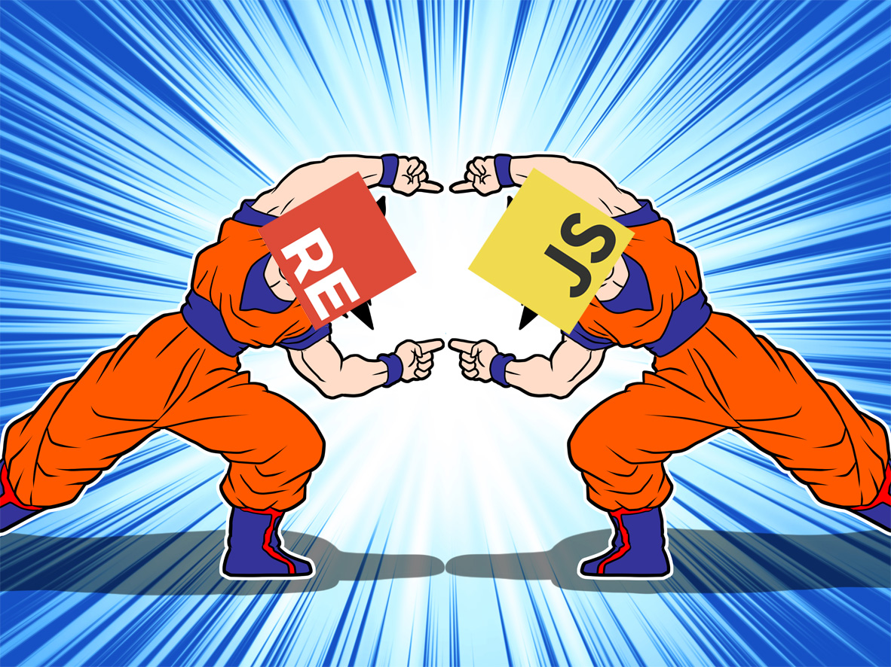
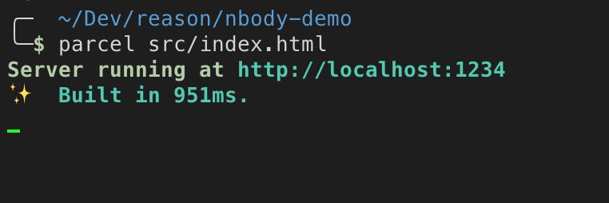
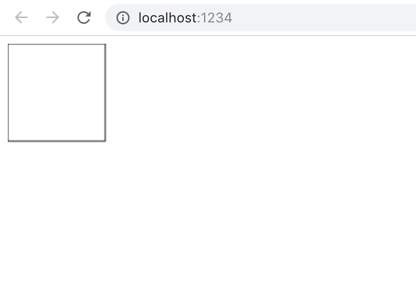
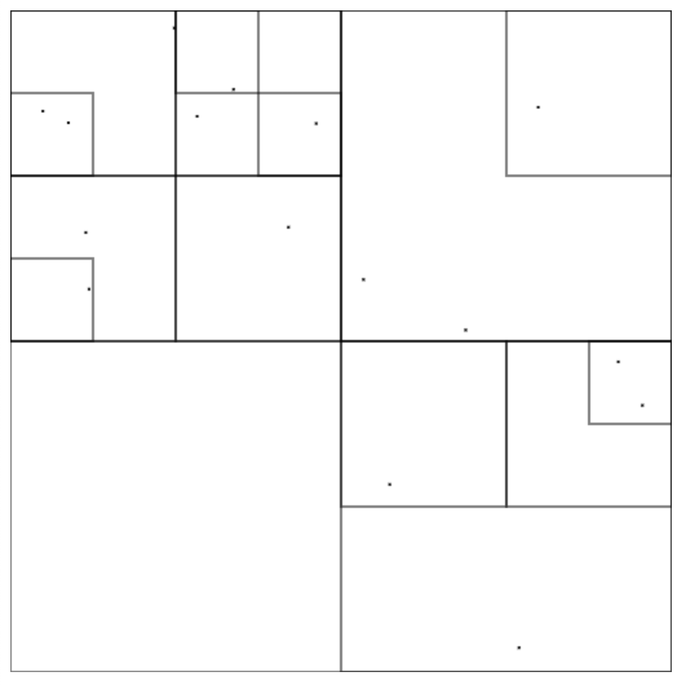

While writing your app sometimes you will want to use some functions or values from javascript code (native or some libraries). Some functions are already provided like `Js.log` and for others you will need to write bindings. This might sound like a chore and it kind of is a chore but I think it is worth it. Remember when TypeScript didn't have a type declarations for every library in npm?

## Basic interop example

To get to a variable `Math.PI` from js we would write something like this:

```reason
[@bs.val] external pi: float = "Math.PI";
```

Let's walk through this code. In here we declare external value called `pi` that has a type of float. It looks like a `let`, except that the value is a string and in this example that string is a value that we are binding to.

Now about this `[@bs.val]` thing. It's probably an unfamiliar syntax construction for you. It was for me at least.

## PPX

PPX is a language feature of OCaml/Reason that allows to modify your code. You can think of it as a babel plugin. It essentially transforms Abstract Syntax Tree of your code.

For more documentation about PPX that bind js value head over [here](https://bucklescript.github.io/bucklescript/Manual.html#_binding_to_simple_js_functions_values)

## Performance

Surely, you might thinking, this kind of mapping has some performance penalty but `external`s are turned into expected values during compilation and completely erased. Let's take a look at example with `Math.PI`.

_Example.re_

```reason
[@bs.val] external pi: float = "Math.PI";

Js.log(pi +. pi);
```

Here we use binding to `Math.PI` value and log the sum.

_Example.bs.js_

```js
console.log(Math.PI + Math.PI)
```

> In this post I omit comments and exports from generated javascript

No traces of any bindings are present! The values were inlined as expected and the output isn't that different from something that was written in JS manually.

## Canvas API

This is a continuation of part 1 post, so if you haven't that yet now is the time.

I want to visualize the quadtree implemented in previous post. For that I will use [Canvas API](https://developer.mozilla.org/en-US/docs/Web/API/Canvas_API) as it provides simple APIs for drawing primitive shapes like lines, rectangles and circles.

First of all we need to get canvas dom element. For that I'll bind `document.getElementById` function and assume that it will always return `canvas` element. While this assumption is not particularly smart but for this little project it'll get the job done.

First we need to define Canvas type.

_Canvas.re_

```reason
type t;
```

And then lets bind `document.getElementById` to `getCanvasById` function.

_Canvas.re_

```reason
type t;

[@bs.val]
external getCanvasById: string => t =
  "document.getElementById";
```

As you can see from type signature it takes string (id) and returns value of type `t` — canvas.

Lets test it and checkout the compiled js.

By default reasonml will remove unused code:

_Canvas.bs.js_

```js
/* This output is empty. Its source's type definitions, externals and/or unused code got optimized away. */
```

So to test it lets use it in some way

```reason
let canvas = getCanvasById("test");
```

And the compiled js looks like this:

```js
var canvas = document.getElementById("test")
```

Looks good to me. Now we need to get 2d context from canvas;

```reason
type context;

[@bs.send] external getContext: (t, string) => context = "getContext";
```

First we need to define type for context and then to define `getContext` function.

There you can see `[@bs.send]` ppx that will bind function in the following way. It will take first argument (`t`) then will use method defined in the body (`getContext`) and apply the rest of the arguments (`string`) to that method.

So the result will look like this `t.getContext(string)`.

If the body of a external is the same as a value's name we can replace it with an empty string:

```reason
[@bs.send] external getContext: (t, string) => context = "";
```

## Error handling

Let's take a step back for a second. Both functions `getElementById` and `getContext` can return `null` and it should be handled correctly. While writing it's easy to say that "Ah it will probably never return null in real world" and that's how unreliable code is born. With reason we don't want to have runtime exceptions.

To correctly write bindings we need to include a path with failure.

My first idea was to make it return option.

```reason
[@bs.val] external getCanvasById: string => option(t) = "document.getElementById";

switch (getCanvasById("test")) {
| Some(_) => Js.log("There is a canvas!")
| None => Js.log("There is no canvas :(")
};
```

Let's look at the generated javascript and see why this won't work as we need.

```js
var match = document.getElementById("test")

if (match !== undefined) {
  console.log("There is a canvas!")
} else {
  console.log("There is no canvas :(")
}
```

What it does here is compares it to `undefined` but `getElementById` return `null` when no node is found so this is a problem as `null` doesn't strictly equal to `undefined`.

For handling both `null` and `undefined` there is a `Js.Nullable` module that works similar to `option` and in fact can be converted to option using `Js.Nullable.toOption`.

```reason
[@bs.val]
external getCanvasById: string => Js.Nullable.t(t) =
  "document.getElementById";

switch (Js.Nullable.toOption(getCanvasById("test"))) {
| Some(_) => Js.log("There is a canvas!")
| None => Js.log("There is no canvas :(")
};
```

and in the generated code it uses non-strict equality operator `==` to compare it against `null` that will cover both `undefined` and `null` cases. Much better!

```js
var match = document.getElementById("test")

if (match == null) {
  console.log("There is no canvas :(")
} else {
  console.log("There is a canvas!")
}
```

But I actually don't want to deal with additional type `Js.Nullable` when there is `option` type so I'll just [shadow](https://reasonml.github.io/docs/en/let-binding#bindings-are-immutable) them with functions that convert result to the `option`.

```reason
[@bs.val]
external getCanvasById: string => Js.Nullable.t(t) =
  "document.getElementById";
let getCanvasById = id => getCanvasById(id)->Js.Nullable.toOption;

[@bs.send] external getContext: (t, string) => Js.Nullable.t(context) = "";
let getContext = canvas => getContext(canvas, "2d")->Js.Nullable.toOption;
```

If you're not familiar with fast pipe syntax `->` it places left side as a first argument of a right side function.
And I also hardcoded value `2d` as it is the only type of context that we'll need in this example.

```reason
a->b /* Both variants are the same */
b(a)
```

So in the end we can write it like this:

```reason
let ctx =
  switch (getCanvasById("test")) {
  | Some(canvas) => getContext(canvas)
  | None => None
  };
```

What we doing here is essentially chaining two functions `getCanvasById` and `getContext`. If we look at their signatures we can notice that they are kind of composable.

```reason
string => option(Canvas.t)
Canvas.t => option(context)
```

If only there were no `option`s we could write it as simple as `getCanvasById("test")->getContext`.

For this pattern of chaining functions that return `option` we can use `Belt.Option.flatMap`. It takes value of type option and function that returns `option` meaning there are two paths:

- happy path when there is Some value
- error path with value None

With `flatMap` we can chain and handle this paths in a readable way.

```reason
let ctx = getCanvasById("test")->Belt.Option.flatMap(getContext);
```

> [Belt](https://bucklescript.github.io/bucklescript/api/Belt.html) is a standard library that contains among other things collections like Set, Map, Hashset and utils like `Belt.Option`.

## Drawing shapes

Lets bind `strokeRect` function and try to draw something on the screen:

```reason
[@bs.send]
external strokeRect: (context, float, float, float, float) => unit = "";

let draw = ctx => {
  ctx->strokeRect(0.0, 0.0, 100.0, 100.0);
};

let ctx = getCanvasById("test")->Belt.Option.flatMap(getContext);
switch (ctx) {
| Some(context) => draw(context)
| None => Js.log("Failed to create context")
};
```

Now so far we have `Canvas.re` file but we need to show that on an actual page so lets create `index.html`

```html
<canvas id="test"></canvas>
<script src="./Canvas.re"></script>
```

Where we include `./Canvas.re`. And to compile this I'll use [parcel-bundler](https://parceljs.org/)





## Drawing tree

And the rest of the code for drawing a tree. There are no new language features here so it should be quite straightforward to understand.

```reason
[@bs.send]
external clearRect: (context, float, float, float, float) => unit = "";

// Define screen size
let size = 512.0;

let drawTree = (ctx, tree: Tree.t) => {
  // Clear all screen
  ctx->clearRect(0.0, 0.0, size, size);

  let rec step = (tree: Tree.t) => {
    let point = tree.bbox.topLeft;
    let side = tree.bbox.side;
    // Draw bounding box
    ctx->strokeRect(point.x, point.y, side, side);
    // Draw body if present
    switch (tree.body) {
    | Some(b) => ctx->strokeRect(b.pos.x, b.pos.y, 1.0, 1.0)
    | None => ()
    };
    // Recursively draw children
    Tree.forEachChild(tree, step);
  };

  step(tree);
};

let ctx = getCanvasById("test")->Belt.Option.flatMap(getContext);
let tree = Tree.makeRandom();
Js.log(tree);

switch (ctx) {
| Some(context) => drawTree(context, tree)
| None => Js.log("Failed to create context")
};
```

And here is the result



## Final code

Right now it's a bit messy because it contains parts of code that have different responsibilities, for example binding and tree drawing, but for educational purposes, I think, it's better to read everything in one file like a book.

```reason
type t;
type context;

[@bs.val]
external getCanvasById: string => Js.Nullable.t(t) =
  "document.getElementById";
let getCanvasById = id => getCanvasById(id)->Js.Nullable.toOption;

[@bs.send] external getContext: (t, string) => Js.Nullable.t(context) = "";
let getContext = canvas => getContext(canvas, "2d")->Js.Nullable.toOption;

[@bs.send]
external strokeRect: (context, float, float, float, float) => unit = "";

[@bs.send]
external clearRect: (context, float, float, float, float) => unit = "";

// Define screen size
let size = 512.0;

let drawTree = (ctx, tree: Tree.t) => {
  // Clear all screen
  ctx->clearRect(0.0, 0.0, size, size);

  let rec step = (tree: Tree.t) => {
    let point = tree.bbox.topLeft;
    let side = tree.bbox.side;
    // Draw bounding box
    ctx->strokeRect(point.x, point.y, side, side);
    // Draw body if present
    switch (tree.body) {
    | Some(b) => ctx->strokeRect(b.pos.x, b.pos.y, 1.0, 1.0)
    | None => ()
    };
    // Recursively draw children
    Tree.forEachChild(tree, step);
  };

  step(tree);
};

let ctx = getCanvasById("test")->Belt.Option.flatMap(getContext);
let tree = Tree.makeRandom();
Js.log(tree);

switch (ctx) {
| Some(context) => drawTree(context, tree)
| None => Js.log("Failed to create context")
};
```
