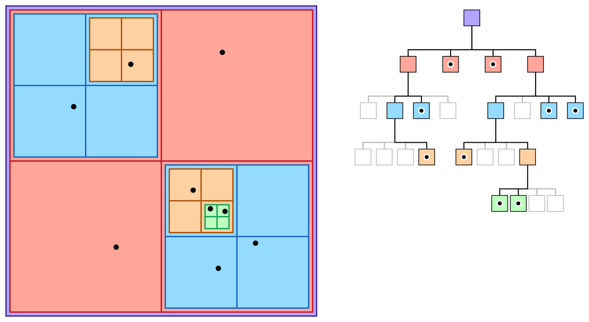

## Hi

I really want to share with you about this magnificent language [ReasonML](https://reasonml.github.io/).

Before we start let me tell you that this is a gentle introduction for people mainly coming from javascript beackground (like me). I'm by no means an expert in reason or functional programming and if you are serious about learning reason you should checkout out (after reading this post of course) [official documentation](https://reasonml.github.io/docs/en/what-and-why) and [awesome book by Dr Axel Rauschmayer](http://reasonmlhub.com/exploring-reasonml/toc.html).

## Intro

Remember when you first chained `map` calls on array in js? Remember how cool you felt when you wrote your first `.reduce((a,b) => a + b)`? If you're like me than you probably found that writing and composing pure functions
just felt 'right'. Writing functional code is very satisfying. And while javascript has some cool functional tricks built-in (like first class functions, closuers, etc) it still has some flaws (who needs both `null` and `undefined`?) and shortcomings that aren't trivial to improve/fix because of that whole "don't break the web" stuff.

To improve experience of writing code that runs on web several compile-to-js languages popped out. Some were succesful and some were not. Today I'll try to show that this language is [serious business](https://www.youtube.com/watch?v=lzEweA7RPi0).

ReasonML — a functional programming language oriented mainly towards javascript developers. Let's look at some of the benefits it offers:

- **Compilation to JS**  
  It compiles to javascript. Not only it produces mostly readable and performant javascript code but it happens really fast. TypeScript i really love you but damn your builds are slow.

- **Full-featured battle-tested functional programming language**  
  ReasonML is actually OCaml with a different syntax. And while Reason is relatively new project, OCaml is not. It's more than 20 years old language.

- **Sound type system**  
  It means that types don't lie to you. "Pure Reason program has no null bugs."

- **Familiar syntax**  
  You can probably already read it just fine. It looks just like js. (for a _reason_ <sup><sub>sorry I promise I won't do reason puns</sub></sup>)

## Show, don't tell

After playing with it I had an urge to write something that I never really liked. I never liked writing tree structures and recursive functions. Oh the sweet memories of juggling with pointers and if statements in c++ to make trees and mental gymnastics to figure out how to write that recursive functions. I hated it. Until I tried Reasonml.

You probably know about N-Body simulation. Also why did everyone still let them get away with naming variables with one letter? And it's different letter every time (look at k-nn!!)

There is this approximation of n-body simulation called Barnes–Hut simulation. Using it I want to create a interactive playground with potentially large amount of bodies. (Something inspired by falling sand game).

Welcome to my let's write episode 1 of 500.

In this post I'll implement one part of Barnes–Hut simulation which is spatial quadtree. It is not that complicated as it sounds and just means that it divides 2D space into squares and every node in the tree can have up to 4 children. To do a division of 3D space we would need an octotree.



Walk with me. Process of setting up reason project is described over [here](https://reasonml.github.io/docs/en/installation) but if you're too lazy to click that here are commands to paste in terminal:

```sh
yarn global add bs-platform
bsb -init my-new-project -theme basic-reason
```

Also don't forget to grab a [plugin](https://marketplace.visualstudio.com/items?itemName=jaredly.reason-vscode) for your favorite editor.

Let's start from the module called Vector.
In Reason every file is a [Module](https://reasonml.github.io/docs/en/module). Module name has to be capitalized.

**Vector.re**

```reason
type t = {
  x: float,
  y: float,
};

let make = (x, y) => {x, y};

let add = (v1, v2) => {x: v1.x +. v2.x, y: v1.y +. v2.y};

let random = max => make(Js.Math.random() *. max, Js.Math.random() *. max);
```

Everything from module is available in every part of your program by writing for example `Vector.add`. No export/import is needed.

Notice how it has declared `type t`? When we want to describe type of vector we would probably call that type `vector` right? But we already have a module `Vector` named like that so in reason there is a convention to use `t` as a name for main type of the module.

Let's look at function `make`

```reason
let make = (x, y) => {x, y};
```

Can you guess what it does? One thing that you might notice is that there are no types. That beacuse types are inferred (guessed). By looking at current scope reason can notice that there is a type that has the same shape as the return shape `{x, y}` and from that type it knows that `x` and `y` are floats. Pretty cool, right? And while most of the times it can guess correctly you can still write types yourself.

```reason
let make = (x: float, y: float): t => {x, y};
```

On to the next line! Adding vectors:

```reason
let add = (v1, v2) => {x: v1.x +. v2.x, y: v1.y +. v2.y};
```

Pretty straightforward but wait what are those dots after plus sign? Remember all those jokes from backend devs about how you can write `[]+![]` and get an `false` string in js? Yeah we can't do that in reason. For adding integers there is `+` operator and for adding floats there is `+.` operator (and it is the same with other math operations). [That might change in future](https://reasonml.github.io/docs/en/integer-and-float#design-decisions).

```reason
let random = max => make(Js.Math.random() *. max, Js.Math.random() *. max);
```

In this function we are calling native js function `Math.random` by using `Js` module.

Let's define body as something that has mass and position.

**Body.re**

```reason
type t = {
  mass: float,
  pos: Vector.t,
};

let make = () => {mass: 10.0, pos: Vector.random(512.0)};
```

Next, I'll add the module for bounding box. We will construct quadtree out of these squares and we will also need to split them into four equal boxes also called quadrants.

```reason
type t = {
  topLeft: Vector.t,
  side: float,
};
```

Box definition consists of its' top left point and size of the side.

```reason
type quadrant =
  | NE
  | NW
  | SE
  | SW;
```

Alright something new. What you see here is called [Variant type](https://reasonml.github.io/docs/en/variant). Marked with an exclamation point in reason documents because of how awesome this thing is.

What we are declaring here is that `quadrant` is a type that can be either of these values: NE, NW, SE, SW. This is a supersimple example of a variant type but don't judge it as a enum just yet. I'll show more of it later.

```reason
let getSubquadrantBbox = (bbox, quadrant) => {
  let halfSide = bbox.side /. 2.0;

  let topLeftOffset =
    switch (quadrant) {
    | NW => Vector.make(0.0, 0.0)
    | NE => Vector.make(halfSide, 0.0)
    | SW => Vector.make(0.0, halfSide)
    | SE => Vector.make(halfSide, halfSide)
    };

  {side: halfSide, topLeft: Vector.add(bbox.topLeft, topLeftOffset)};
};
```

In this function we want to get one of the four possible subquadrants of the box. New size will be exactly half of the current box and then we need to calculate where the new top left point will be. Here the (pattern matching)[https://reasonml.github.io/docs/en/pattern-matching] expression is used. In docs it is called "one of the best features of the language" and I agree. In short, concise way it is handling all variants of the quadrant variable. Also it will scream at you if you forget to handle some variant. (Have you ever forgot to handle some action in redux reducer? I sure did) Did you notice that you can assign it to a value?

Last value in the body of the function is returned so we don't need to write `return`.

```reason
let quadrantFromPoint = (bbox, point: Vector.t) => {
  let {topLeft, side} = bbox;
  let center = Vector.add(topLeft, Vector.make(side /. 2.0, side /. 2.0));

  switch (point.x > center.x, point.y > center.x) {
  | (true, true) => SE
  | (true, false) => NE
  | (false, true) => SW
  | (false, false) => SE
  };
};
```

In this function we return in which quadrant is the point. A beloved feature in js [destructuring](https://reasonml.github.io/docs/en/destructuring) is also here.
And we are using pattern matching on two boolean values because we can.

With Vector, Body and BBox modules done lets write octotree.

**Tree.re**

```reason
type t = {
  body: option(Body.t),
  bbox: BBox.t,
  ne: option(t),
  nw: option(t),
  se: option(t),
  sw: option(t),
};
```

There is a new `option` type here. In reason there are no null or undefined and thats great. Instead `option` type is used for values that can be empty. You can skip this if you're familiar with Java Optional type.

### Option

Lets imagine we have a function that searches and maybe returns string as result.

```reason
let searchResult = search(); /* Does some search and returns option(string) */
```

Result can be either `Some(string)` or `None`.
In fact `option` is just a variant type defined like this:

```reason
type option('a) = None | Some('a)
```

Where `'a` means some type. Similar to T in generics in other languages.

And to handle such value we can use pattern matching.

```reason
switch(searchResult) {
  | None => Js.log("No result :(")
  | Some(result) => Js.log("Result is: "++result)
}
```

In second case we unpacked `result` from `Some` value and were forced to handle empty result.

You can read more about Option [here](https://reasonml.github.io/docs/en/null-undefined-option).

So going back to our tree example. We are defining tree node as record that has a defined bounding box in space, maybe has a body and maybe has four child nodes in four quadrants. This type is recursive.

```reason
let make =
    (
      ~bbox: BBox.t={side: 512.0, topLeft: Vector.make(0.0, 0.0)},
      ~body=None,
      (),
    ) => {
  body,
  bbox,
  ne: None,
  nw: None,
  se: None,
  sw: None,
};
```

Function `make` creates a tree node. It takes two named parameters. To make a parameter named we put a `~` sign before its name. Both of these parameters have default value defined after `=` sign. To make named parameter optional you can use `?` as default value. Ok so why does it have empty brackets as a third parameter? Because of the currying it is unclear what to do with function when using some of the parameters. Should function call `make(~body)` return new curried function or should it call `make` function because `~bbox` is optional? For that reason we need to add positional argument (non-labeled) which is conventionally `()`.

Like in javascript if field name and value are named the same we can write it once

```reason
let a = {
  body: body
}
let b ={
  body
}
```

Both are the same.

Simple function for returning a child from the node

```reason
let getNode = (tree, quadrant: BBox.quadrant) =>
  switch (quadrant) {
  | SE => tree.se
  | NE => tree.ne
  | SW => tree.sw
  | NW => tree.nw
  };
```

In this function we define type for the quadrant because it is not in scope. For that we would need to open module like this:

```reason
open BBox
```

It will make contents of the module visible in scope (not copied) so we could write `quadrant` instead of `BBox.quadrant`.

Function for adding a child to a node:

```reason
let setNode = (tree: t, where: BBox.quadrant, node: t) =>
  switch (where) {
  | SE => {...tree, se: Some(node)}
  | NE => {...tree, ne: Some(node)}
  | SW => {...tree, sw: Some(node)}
  | NW => {...tree, nw: Some(node)}
  };
```

Oh yeah, spread operator is also present in Reason!

Function for creating single node:

```reason
let createNode = (bbox: BBox.t, quadrant: BBox.quadrant, body: Body.t) => {
  let subquadrant = BBox.getSubquadrantBbox(bbox, quadrant);
  make(~bbox=subquadrant, ~body=Some(body), ());
};
```

Notice how `body` is wrapped in `Some`. Because `~body` parameter is of type `option` we can't just pass the value.

Function for inserting a body intro a tree:

```reason
let rec insert = (tree: t, body: Body.t) =>
  switch (tree.body) {
  | Some(_) =>
    let quadrant = BBox.quadrantFromPoint(tree.bbox, body.pos);
    let child = getNode(tree, quadrant);

    switch (child) {
    | Some(node) => insert(node, body)
    | None => setNode(tree, quadrant, createNode(tree.bbox, quadrant, body))
    };
  | None => {...tree, body: Some(body)}
  };
```

Here comes the most interesting part: recursive function for inserting nodes. Look how small it is!! I must admit that this is not first version of this function but after some tries I'm really happy with the result.

In this function we need to find and/or create a node for body. We either find appropriate box with no body or recursively divide space until we do.

## Compling

After running `bsb -make-world` it will compile every `.re` file to `.bs.js` and I encourage you to look at the produced code as it is quite readable and interesting. For example options' `None` value is just an `undefined` how cool is that?

## Next

If we hit 100k likes then I'll try to visualize the quadtree using Canvas API and show you how to do JS interop in the next part.
